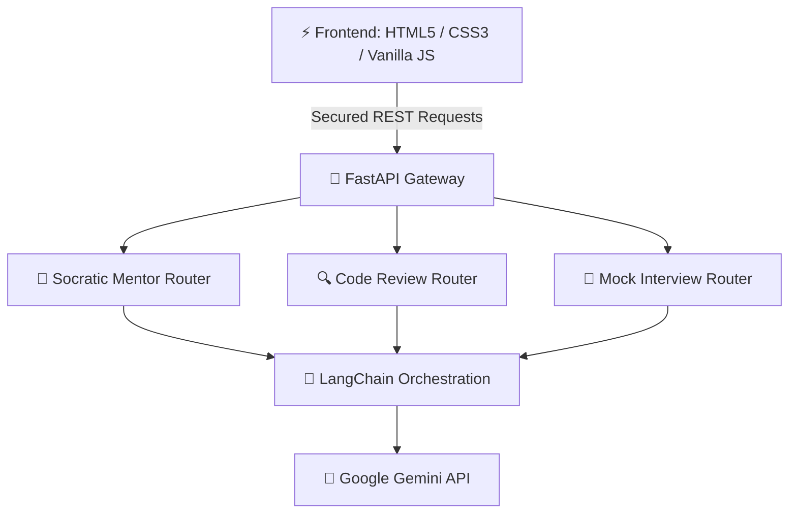

# <p align="center"></p>

<p align="center">
  <strong>Your Personal AI-Powered Coding Sensei & Technical Interview Coach</strong>
</p>

<p align="center">
  
  
  
  
  
  
  
</p>

---

## 💡 What is AlgoSensei?

Unlike standard AI coding assistants that simply write code for you, **AlgoSensei** teaches you how to think. It guides developers through structured technical interview preparation using Socratic mentoring, automated deep code reviews, conversational mock interviews, and locally-stored learning analytics.

---

## 🗺️ System Architecture



---

## ✨ Product Capabilities

### 🧠 1. AI Coding Mentor (Socratic Tutoring)
* Guiding, question-based tutoring that helps you optimize brute-force implementations without giving away direct answers.
* Interactive chat with syntax-highlighted code blocks.

### 🔍 2. Automated Code Review
* Deep analysis of code quality, time complexity ($O(N)$), space complexity, bugs, edge cases, and optimization suggestions.

### 🤝 3. Mock Technical Interviews
* Round-by-round conversational mock interviews covering **DSA, DBMS, OOP, OS, and System Design**.
* Scores responses dynamically and outputs final scorecard metrics (strengths, weaknesses, next steps).

### 📊 4. Local-First Learning Analytics
* Track your readiness score, topic spread, and mock history completely client-side in `localStorage`. Zero login screens or server databases required.

---

## 📸 Platform Showcase

### 🏠 Landing Page


### 🧠 Socratic Mentoring


### 🔍 Code Review Insights


### 🤝 Mock Interviews


### 📊 Readiness Analytics


---

## 🛠️ Local Development

### 🐍 Backend Service Setup
1. Navigate to the Backend folder:
   ```bash
   cd Backend
   ```
2. Create and activate a Python virtual environment:
   ```bash
   python -m venv .venv
   # Windows:
   .\.venv\Scripts\activate
   # macOS/Linux:
   source .venv/bin/activate
   ```
3. Install dependencies:
   ```bash
   pip install -r requirements.txt
   ```
4. Run the development server with live reload:
   ```bash
   uvicorn main:app --reload --port 8000
   ```

### ⚡ Frontend Setup
Serve the root directory using any static file server (such as Live Server in VS Code) and visit:
* [http://localhost:3000](http://localhost:3000)

> [!IMPORTANT]
> Make sure to configure your API key locally in `Backend/python.env`.

---

<details>
<summary>📂 Click to view Codebase File Structure</summary>

```
├── Backend/
│   ├── app/
│   │   ├── core/           # Env config & settings loading
│   │   ├── models/         # Pydantic schemas (Request/Response validators)
│   │   ├── prompts/        # Prompt engineering markdown templates
│   │   ├── services/       # Core service layer (Gemini Client & Fallbacks)
│   │   └── routers/        # Feature-based REST endpoints
│   ├── main.py             # FastAPI App Entrypoint
│   ├── check_models.py     # API Key Debugging tool
│   └── requirements.txt    # Python dependencies
├── assets/
│   └── app.js              # Theme toggle, local analytics, state management
├── index.html              # Homepage
├── coach.html              # Tutor chat panel
├── code-review.html        # Review dashboard
├── interview.html          # Interactive Mock Interviews
└── dashboard.html          # Analytics page
```
</details>

<details>
<summary>🔌 Click to view API Specification</summary>

| Method | Endpoint | Description |
| :--- | :--- | :--- |
| `GET` | `/` | Backend health check |
| `POST` | `/api/start_session` | Initial Socratic mentor prompt |
| `POST` | `/api/chat` | Continue Socratic mentoring conversation |
| `POST` | `/api/code_review` | Deep structured code analysis |
| `POST` | `/api/interview/start` | Launch technical mock interview |
| `POST` | `/api/interview/turn` | Submit interview response and get next question |
| `POST` | `/api/interview/finalize` | Fetch overall mock scorecard |
</details>

---

## 🔒 Security & Deployment Notes

* **API Key Safety**: The backend keeps `python.env` untracked in `.gitignore` to prevent API key leaks.
* **Production Variables**: On Render/Railway, set `GOOGLE_API_KEY` directly inside the hosting platform environment variables instead of committing a file.
* **CORS Settings**: The CORS middleware is set to safely accept requests from your Vercel client domain (`https://algosensei-frontend.vercel.app`) without credential conflicts.
