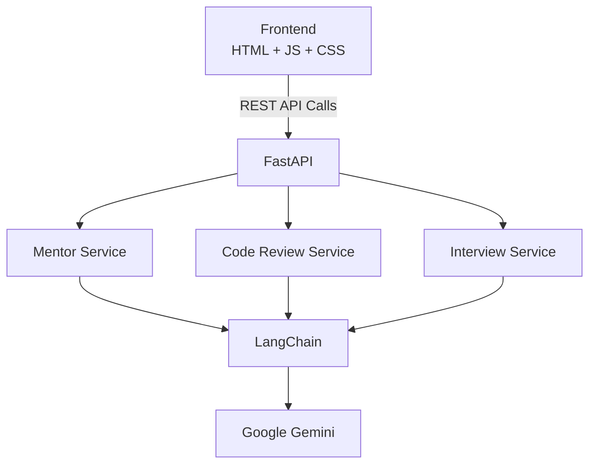

# AlgoSensei – AI Learning Platform for Software Engineers

AlgoSensei is an AI-powered learning platform that helps developers improve their problem-solving skills through Socratic tutoring, automated code reviews, mock technical interviews, and personalized learning analytics. Built using FastAPI, LangChain, Google Gemini, and modern frontend technologies, AlgoSensei focuses on teaching developers how to think rather than simply providing answers.

## Why AlgoSensei?

Most coding assistants solve problems for developers. AlgoSensei teaches developers how to solve problems themselves. Instead of directly generating answers, the platform guides users through structured reasoning, interview-style questioning, and personalized feedback.

## Architecture Diagram



## Engineering Highlights

- Modular FastAPI architecture
- RESTful API design
- LangChain prompt orchestration
- Structured AI workflows
- Automated code analysis
- Mock interview engine
- Browser-side learning analytics
- Stateless backend architecture
- Deployed production application

## Product Capabilities

- Socratic coding mentor for problem solving and interview prep
- Code Review mode with structured feedback on quality, bugs, complexity, edge cases, and optimization
- Mock Interview mode for DSA, DBMS, OOP, OS, and System Design practice
- Learning analytics stored in localStorage with no authentication
- Multi-page frontend deployed on Vercel and backend API deployed on Render

## System Design

AlgoSensei follows a service-oriented architecture. Each feature is isolated into its own FastAPI router and prompt pipeline.

- Mentor Service
- Code Review Service
- Interview Service

This separation allows each workflow to evolve independently while sharing a common AI layer through LangChain and Gemini.

## Backend Architecture

The backend is organized into a resume-ready FastAPI layout:

- `Backend/app/core/` for environment and configuration helpers
- `Backend/app/models/` for request and response schemas
- `Backend/app/prompts/` for mode-specific prompt templates
- `Backend/app/services/` for Gemini and LangChain execution helpers
- `Backend/app/routers/` for API endpoints grouped by feature

This keeps the application modular without changing the deployment model. Render can still start the app with `uvicorn main:app`.

## Screenshots

### Home


### AI Mentor


### Code Review


### Mock Interview


### Analytics Dashboard


## Frontend Pages

- `index.html` for the main mentor experience and feature cards
- `coach.html` for the original Socratic tutoring chat
- `code-review.html` for the new code review workflow
- `interview.html` for the mock interview workflow
- `dashboard.html` for local learning analytics and readiness scoring
- `about.html`, `features.html`, and `contact.html` for supporting product and marketing pages

Each page includes the same top-level mode switcher so users can jump between Mentor, Code Review, Mock Interview, and Dashboard without leaving the product context.

## API Endpoints

- `POST /api/start_session` starts the Socratic mentor flow
- `POST /api/chat` continues the mentor conversation
- `POST /api/code_review` returns structured code review feedback
- `POST /api/interview/start` creates the opening interview question
- `POST /api/interview/turn` evaluates an answer and asks a follow-up
- `POST /api/interview/finalize` generates the final interview score

## Roadmap

Upcoming improvements:

- Retrieval-Augmented Generation (RAG)
- Multi-Agent Learning System
- Personalized Learning Memory
- GitHub Repository Analysis
- DSA Progress Recommendations
- Local LLM Support (Ollama)

## Resume Highlights

Built using:

- FastAPI
- LangChain
- Google Gemini
- REST APIs
- Tailwind CSS
- JavaScript
- Vercel
- Render

Key capabilities:

- AI Tutoring
- Code Review
- Mock Interviews
- Learning Analytics
- Production Deployment

## Local Development

### Backend

```bash
cd Backend
python -m venv venv
.\venv\Scripts\activate
pip install -r requirements.txt
uvicorn main:app --reload
```

Set `GOOGLE_API_KEY` in `Backend/python.env` for local development.

### Frontend

Serve the repository root with Live Server or any static file server, then open `index.html`.

## Deployment Notes

- Keep the frontend as a static site on Vercel
- Keep the backend on Render with the existing FastAPI start command
- Add `GOOGLE_API_KEY` as a Render environment variable
- Update the frontend backend URL only if the Render deployment URL changes
- No authentication, payments, Redis, Docker, or Kubernetes are required for this project
- Analytics stay in localStorage, so each browser profile keeps its own practice history with no database dependency.

## What Changed

- Added Code Review mode
- Added Mock Interview mode
- Added local learning analytics
- Refactored backend into routers, services, prompts, and models
- Improved homepage positioning to look more like an AI SaaS product
- Updated the supporting marketing pages and shared navigation to match the new product positioning
