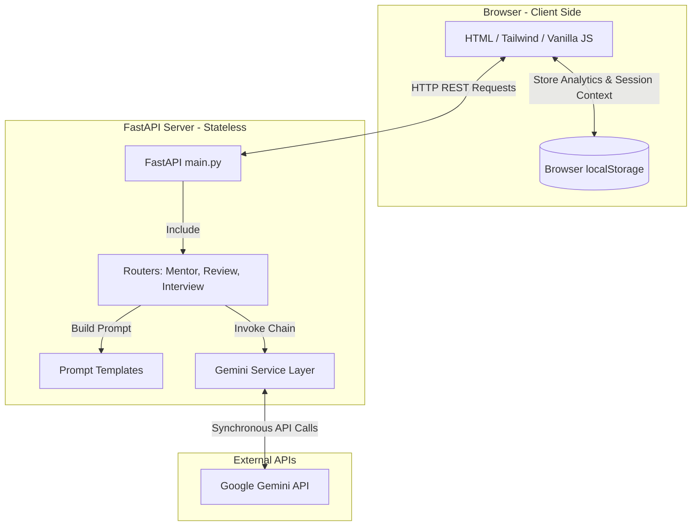

# AlgoSENSEI

### **Your Personal AI Coding Sensei & Technical Interview Coach**

[](#)
[](#)
[](#)
[](#)
[](#)

---

## 📋 One-Line Description
A lightweight FastAPI and vanilla JS web application that provides interactive, Socratic coding mentorship, structured code reviews, conversational mock interviews, and client-side learning analytics.

---

## 💡 Problem Statement
Standard AI coding assistants often encourage passive learning by handing over optimized code solutions directly. This prevents developers from developing active problem-solving intuition and deep reasoning, which are essential for passing modern technical interviews.

---

## 🛠️ Solution
AlgoSensei is a local-first, split-stack platform built to facilitate active interview preparation. Instead of writing code for you, the application uses tailored system instructions and output schemas to guide you through:
1. **Socratic Coding Mentorship**: Prompt-guided tutoring that asks targeted questions to help you improve your own code.
2. **Automated Code Reviews**: Detailed complexity, bug, and edge-case analysis.
3. **Conversational Mock Interviews**: Scenario-based, multi-round technical interviews covering DSA, DBMS, OOP, OS, and System Design.
4. **Local Analytics**: Immediate feedback and readiness scores computed and stored entirely inside your browser, eliminating database friction and costs.

---

## ⚙️ Tech Stack
*   **Backend**: FastAPI (Python), LangChain (`langchain-core` and `langchain-google-genai`), Uvicorn, python-dotenv
*   **Frontend**: HTML5, Tailwind CSS (via CDN), Vanilla JavaScript (ES6)
*   **LLM Orchestration**: Google Gemini models (Primary: `gemini-1.5-flash`; Fallbacks: `gemini-2.5-flash`, `gemini-1.5-pro`)
*   **Database & Storage**: None on the server; client-side browser `localStorage` for private persistence

---

## 🗺️ System Architecture


```mermaid
flowchart TD
    subgraph Client [Browser - Client Side]
        UI[HTML / Tailwind / Vanilla JS]
        LS[(Browser localStorage)]
        UI <-->|Store Analytics & Session Context| LS
    end

    subgraph Backend [FastAPI Server - Stateless]
        GW[FastAPI main.py]
        R[Routers: Mentor, Review, Interview]
        P[Prompt Templates]
        S[Gemini Service Layer]

        GW -->|Include| R
        R -->|Build Prompt| P
        R -->|Invoke Chain| S
    end

    subgraph External [External APIs]
        G[Google Gemini API]
    end

    UI <-->|HTTP REST Requests| GW
    S <-->|Synchronous API Calls| G
```

### End-to-End Request/Data Flow
1.  **Session Setup**: The user enters their problem statement, code, and language on `index.html`. This information is saved to the browser's `localStorage` and the client redirects to the coach page.
2.  **Mentorship / Review / Interview Session**:
    *   **Mentor**: The frontend reads local data and sends a request to `/api/start_session` or `/api/chat`. The backend constructs a Socratic prompt template and calls Gemini.
    *   **Review**: The user pastes code into `code-review.html`. The backend parses the code structure, queries Gemini for structured Big-O and review insights, and returns a JSON payload.
    *   **Interview**: The user selects a domain (e.g., OOP, System Design) in `interview.html`. The frontend starts the interview by calling `/api/interview/start`. Successive user answers are processed round-by-round through `/api/interview/turn`. When the round limits are reached, `/api/interview/finalize` generates a final scorecard.
3.  **Local Analytics Update**: On every successful code review, solved question, or interview completion, the frontend JavaScript updates the practice frequencies and score metrics directly in `localStorage`. The dashboard (`dashboard.html`) dynamically aggregates these metrics client-side to calculate an overall "Interview Readiness Score."

---

## 📂 Project Structure
```
├── Backend/
│   ├── app/
│   │   ├── core/           # Env settings configuration
│   │   ├── models/         # Pydantic validation schemas
│   │   ├── prompts/        # Chat prompt templates (Socratic, Review, Interview)
│   │   ├── services/       # Core service layer (Gemini Client & Fallbacks)
│   │   └── routers/        # FastAPI feature routers
│   ├── main.py             # FastAPI Application Gateway
│   ├── check_models.py     # Connection validation script
│   ├── python.env.example  # Template environment file
│   └── requirements.txt    # Python dependencies
├── assets/
│   └── app.js              # State, theme, and localStorage analytics
├── index.html              # Homepage & Mentor entry
├── coach.html              # Tutor chat panel
├── code-review.html        # Review dashboard
├── interview.html          # Mock technical interviews
└── dashboard.html          # Analytics page
```

---

## 🚀 Local Development

### 🐍 Backend Service Setup
1.  Navigate to the Backend folder:
    ```bash
    cd Backend
    ```
2.  Create and activate a Python virtual environment:
    ```bash
    python -m venv .venv
    # Windows:
    .\.venv\Scripts\activate
    # macOS/Linux:
    source .venv/bin/activate
    ```
3.  Install dependencies:
    ```bash
    pip install -r requirements.txt
    ```
4.  Copy the example env file and insert your API key:
    ```bash
    cp python.env.example python.env
    ```
5.  Run the development server:
    ```bash
    uvicorn main:app --reload --port 8000
    ```

### ⚡ Frontend Setup
Serve the root directory using any static web server (such as Live Server in VS Code or `python -m http.server 3000` from the repository root) and visit:
*   [http://localhost:3000](http://localhost:3000)

---

## 🔌 API Documentation

| Method | Endpoint | Description | Request Payload | Response Fields |
| :--- | :--- | :--- | :--- | :--- |
| `GET` | `/` | Backend health check | None | `{"message", "architecture"}` |
| `POST` | `/api/start_session` | Initial Socratic mentor prompt | `CodeInput` | `{"from", "text"}` |
| `POST` | `/api/chat` | Continue Socratic mentoring conversation | `ChatInput` | `{"from", "text"}` |
| `POST` | `/api/code_review` | Deep structured code analysis | `CodeReviewInput` | `{"from", "code_quality_analysis", "time_complexity", "space_complexity", "potential_bugs", "edge_cases", "optimization_suggestions", "interview_feedback"}` |
| `POST` | `/api/interview/start` | Launch technical mock interview | `InterviewStartInput` | `{"from", "question", "score", "round_number"}` |
| `POST` | `/api/interview/turn` | Submit interview response and get next question | `InterviewTurnInput` | `{"from", "evaluation", "follow_up", "score", "round_number", "should_end"}` |
| `POST` | `/api/interview/finalize`| Fetch overall mock scorecard | `InterviewFinalInput` | `{"from", "overall_score", "verdict", "strengths", "weaknesses", "next_steps"}` |

---

## 🧪 Testing and Debugging
To verify that your Gemini API key is configured correctly and the backend can successfully connect to Google GenAI, run the validation script:
```bash
cd Backend
python check_models.py
```

---

## 🔒 Security & Deployment Notes
*   **Permissive CORS**: The backend CORS middleware is configured to accept requests from all origins (`allow_origins=["*"]`). While convenient for local split-stack setups and demo deployments, this should be restricted to the specific frontend domain in production.
*   **API Key Protection**: API keys are loaded using `python-dotenv` from the git-ignored `python.env` file. Do not commit keys to GitHub. Set `GOOGLE_API_KEY` directly in your hosting provider's environment settings (e.g., Render, Railway) for production.
*   **Unauthenticated Access**: Endpoints are public and do not implement user authentication.

---

## ⚠️ Limitations & Future Improvements

### Limitations
1.  **No Server-Side Persistence**: Users cannot access their history across devices because analytics and conversational states are stored client-side. Clearing browser cache resets all stats.
2.  **Stateless API Design**: The backend maintains no conversational memory. The client must pass the entire chat history in every `/api/chat` and `/api/interview/turn` request.
3.  **Synchronous API Calls**: Invocations to the Gemini API are executed synchronously using LangChain's blocking `invoke()` function. To prevent event loop starvation under high concurrency, backend route handlers are defined as standard synchronous `def` endpoints so they run in FastAPI's background worker thread pool.
4.  **No Prompt Injection Defense**: Payloads are passed directly into prompt templates without custom input validation or safety guardrails.

### Future Improvements
*   **Retrieval-Augmented Generation (RAG)**: Connect localized PDF loaders and vector indexes to allow customized interview prep syllabi.
*   **Multi-Agent Mock Interviews**: Spawn collaborative or adversarial agents (e.g. tough vs. friendly mock interviewers) using LangGraph.
*   **Local LLM Integration**: Support offline mode running local models (e.g., Llama 3) via Ollama.
*   **Repository-Wide Analysis**: Support code reviews for uploaded folders or linked GitHub repositories.
